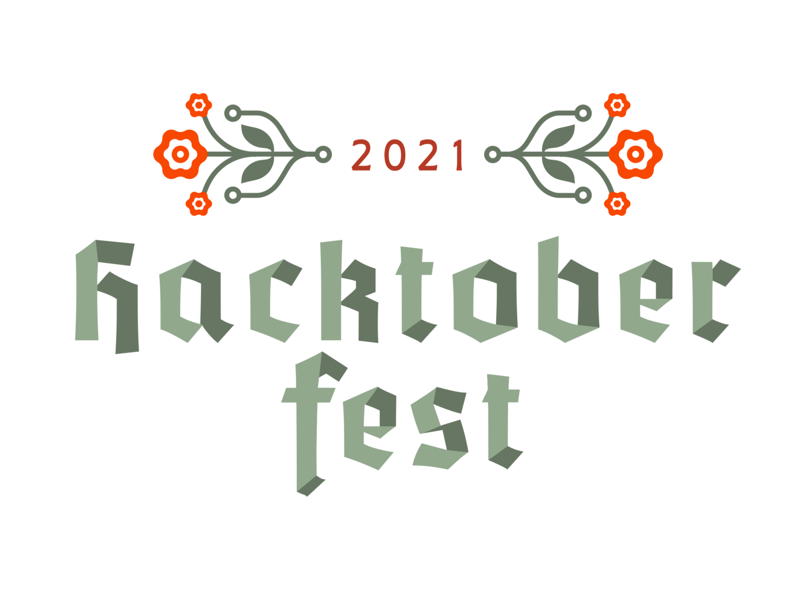

Wow! I love blogging and opensource so much already.

Did you know that Hacktoberfest is the best place to start your opensource journey well truly speaking I wasn't aware of this program when I was starting off but still by the time of hacktoberfest 2021 I was a beginner. so let's target so beginner friendly projects.

### What is Hacktoberfest

Hacktoberfest is a month-long challenge. It happens every year in the month of October. Hacktoberfest is open to everyone and it marks the celebration of Open Source. 

It's the biggest Open Source event that encourages newbies to participate in Open Source and create their 1st meaningful PR.

Hacktoberfest encourages participation in giving back to the open-source community by completing pull requests, participating in events, and donating to open source projects.

Also, all backgrounds and skills levels are encouraged to complete the challenge.

### Things I learn

> Opensource culture is so great that you will learn something new 
EVERY SINGLE DAY

### [link to repository of Contribution](https://github.com/nidhisingh-1/OnlyHTML-CSS)
